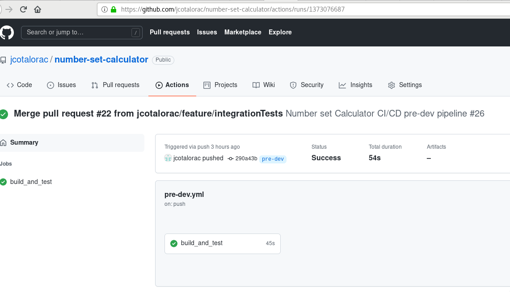
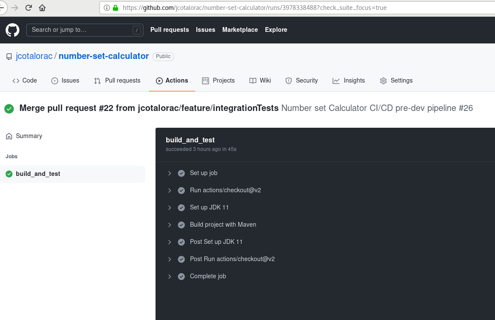

# Number set Calculator

## Overview

This application was built on SpringBoot framework, written in Java 11 with Maven project handler and exposing REST services

The proposed prototype solution consist of the following services:

- Start calculation

This service allows to begin a serial input of operands, belonging to a unique random operation id

- Load operand

This service receives operand input, storing it with associated operation id

- Perform calculation

This service calculate operation with stored operands associated to operation id and given operation, and shows the corresponding result

## Basic flow

The basic interaction with services is made of the following steps:

1. Start calculation

- Method: GET
- Url: /startCalculation
- Result: Response with operation id

2. Load operand

- Method: POST
- Url: /loadOperand
- Request body attributes: operation id, operand
- Result: Response with "OK" or "KO" result

3. Load operand

- Method: POST
- Url: /loadOperand
- Request body attributes: operation id, operand
- Result: Response with "OK" or "KO" result

4. Perform calculation

- Method: POST
- Url: /loadOperand
- Request body attributes: operation id, operand
- Result: Response with operation result

As reference, a set of integration tests are available in src/test/java/com/appgate/application/IntegrationTest.java

A swagger path is available for reference too in

- /swagger-ui

## Considerations

### Simple version of clean architecture

The layers used here are controller, use case and model. Each endpoint is exposed by mean of a concrete class annotated with @RestController and interacts with DTO objects for requests and response.

Each use case is implemented as a functional interface, and instantiated as a Spring service. Each one interacts with model elements.

The model layer wraps the representation of domain objects, as such the in-memory prototyped storage and the set of allowed operations("ADD", "SUBSTRACT", "MULTIPLY", "DIVIDE", "POWER")

Best practices of clean code are used here too. Comments in code are not recommended. Instead, the code itself is part of documentation.

### Use of number

The use of number allows the operation with different number types such as Integer, Float, Double, etc. 

### Deployment strategy

The branches considered are, from development to production:

- init: Initial dependencies for application from scratch
- feature/X: Development of feature X
- fix/X: Branch to fix feature X
- pre-dev: Branch to join feature branches, allowing to solve emerging conflicts for all devs
- dev: Branch to save solved conflicts
- staging: Branch for QA testing purposes
- prod: Branch for production code
- master: Usual reference branch. Maybe used for production purposes or pre-production purposes too

Branches pre-dev, dev, staging, prod and master have build and test jobs on pull requests and push events. An example of a CI/CD script for pre-dev branch is here:

https://github.com/jcotalorac/number-set-calculator/blob/785e61f560b30c68e6c9bffea7286479d3683f4b/.github/workflows/pre-dev.yml

All CI/CD pipeline scripts are available in ./github/workflows folder

Results of execution of pipelines are:

### Spring profiling

In favour of versatility, it's possible to execute application with a configuration profile. For prototype purposes, dev is the active profile.

### Logging

Lombok Slf4j is the library used for logging. Default level is info, and debug is configured in dev profile

### Unit tests

Unit test of all layers are included, using JUnit 5 framework

### Feature enhancements

Possible enhancements for application could be:

- View stored operands in load operand service
- Finish calculation to delete stored operands allowing restart calculation